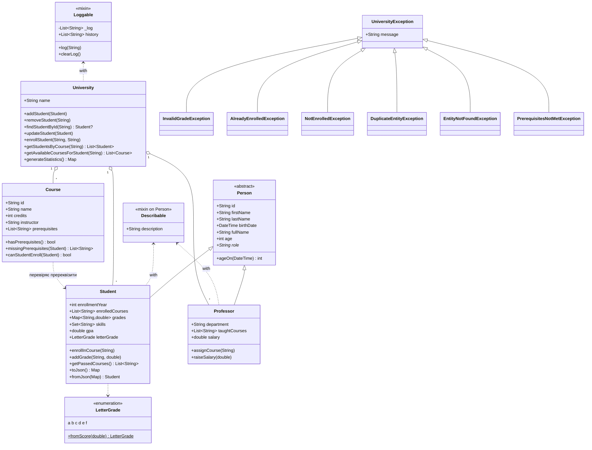

# UML-діаграма класів (Mermaid)

Діаграма відображається на GitHub автоматично. Для здачі зробіть скріншот
або експортуйте через https://mermaid.live.

```mermaid
classDiagram
    direction TB

    class Person {
        <<abstract>>
        +String id
        +String firstName
        +String lastName
        +DateTime birthDate
        +String fullName
        +int age
        +String role*
        +ageOn(DateTime) int
    }
    class Describable {
        <<mixin on Person>>
        +String description
    }
    class Loggable {
        <<mixin>>
        -List~String~ _log
        +List~String~ history
        +log(String)
        +clearLog()
    }
    class Student {
        +int enrollmentYear
        +List~String~ enrolledCourses
        +Map~String,double~ grades
        +Set~String~ skills
        +double gpa
        +LetterGrade letterGrade
        +enrollInCourse(String)
        +addGrade(String, double)
        +getPassedCourses() List~String~
        +toJson() Map
        +fromJson(Map) Student
    }
    class Professor {
        +String department
        +List~String~ taughtCourses
        +double salary
        +assignCourse(String)
        +raiseSalary(double)
    }
    class Course {
        +String id
        +String name
        +int credits
        +String instructor
        +List~String~ prerequisites
        +hasPrerequisites() bool
        +missingPrerequisites(Student) List~String~
        +canStudentEnroll(Student) bool
    }
    class University {
        +String name
        +addStudent(Student)
        +removeStudent(String)
        +findStudentById(String) Student?
        +updateStudent(Student)
        +enrollStudent(String, String)
        +getStudentsByCourse(String) List~Student~
        +getAvailableCoursesForStudent(String) List~Course~
        +generateStatistics() Map
    }
    class LetterGrade {
        <<enumeration>>
        a b c d e f
        +fromScore(double)$ LetterGrade
    }
    class UniversityException {
        +String message
    }

    Person <|-- Student
    Person <|-- Professor
    Describable <.. Student : with
    Describable <.. Professor : with
    Loggable <.. University : with
    University "1" o-- "*" Student
    University "1" o-- "*" Professor
    University "1" o-- "*" Course
    Student ..> LetterGrade
    Course ..> Student : перевіряє пререквізити
    UniversityException <|-- InvalidGradeException
    UniversityException <|-- AlreadyEnrolledException
    UniversityException <|-- NotEnrolledException
    UniversityException <|-- DuplicateEntityException
    UniversityException <|-- EntityNotFoundException
    UniversityException <|-- PrerequisitesNotMetException
```
